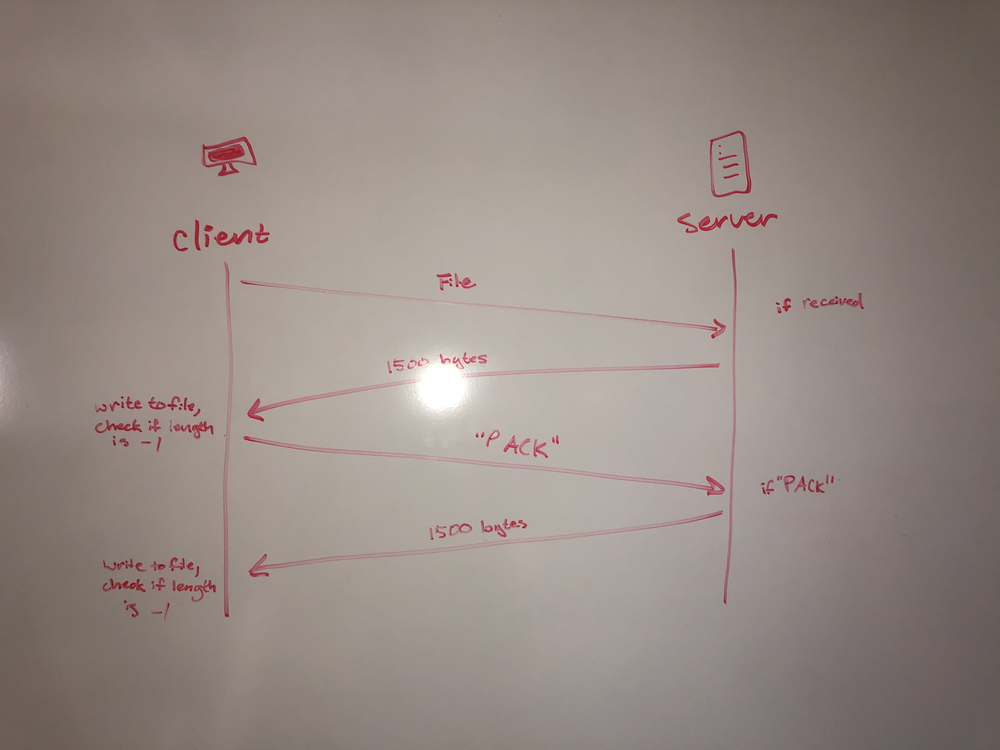
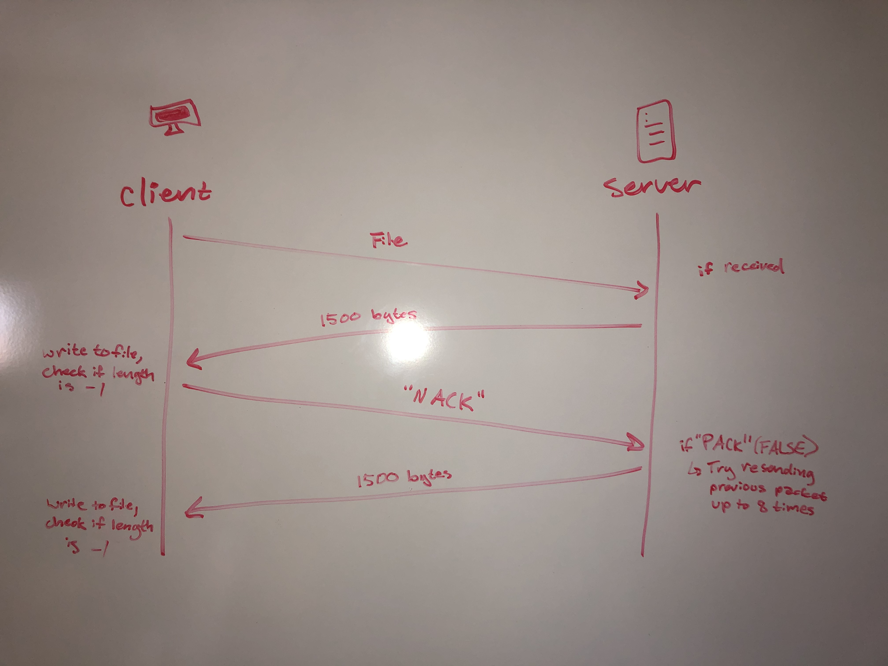

<h1>RFT Project</h1>
	

Authors
------------------------------------------
	
	

<!-- fill out the following table with your information -->
	

<!-- Note: wrapping table in div.noheader will hide the table's header -->
	

<!-- Note: wrapping table in div.firstcol will style the first column different from other columns -->
	

Rose White and Josh Meleski

Specification that describes the designed RFT protocol
-----------------------------------------

<ul>
<li>For the initial send of data, the client sends the file path of the desired server file it wants to write to a file.</li>
<li>The server will check if the requested file exists. If it doesn't the program errors and stops.</li>
<li>If the file does exist, the server reads all of the files contents into a buffer.</li>
<li>The server enters a loop, sending 1500 bytes packets over to the client. It only sends the next if the client sends back a "PACK" (positive ack).
<ul>
<li>The server will resend the packet up to eight times.</li>
<li>On the eighth "NACK" (negative ack) it will finally give up and quit the program.</li>
</ul>
<li>The client will wait to receive the packet. If the packet contains content, the client returns a "PACK"  to the server; but if the contents of the packet is -1/ if a mal packet was sent, it returns a "NACK" to the server. </li>
<li>A timeout method will also be implemented in the case that a packet is dropped and never even reaches the receiver to get a positive or negative aknowledgement. In the case of a timeout, the client will resend the packet again.
<ul>
<li>The client will time out eight times before giving up.</li>
</ul>
</ul>
	
	
	

 Packet sequence diagrams
---------------------------------------------

<figure>
 
 <figcaption>Send Success</figcaption>
 </figure>
 
 <figure>
 
 <figcaption>Send Fail</figcaption>
 </figure>

 
	

 
	

How the design overcomes lost and out of sequence packets
----------------------------------------------
 

To overcome lost and out of sequence packets, we have implemented a method of sending the packets in order. A packet is sent and if it's received, then a positive acknowledgment is sent and the next packet is sent. If the packet was sent without data, then a negative acknowledgment is sent back to the client and the client re-sends the packet. A timeout will also be implemented to catch a delay in the sending of packets due to a packet being dropped. If a packet is sent more than 8 times and still fails, then the whole process fails and an error message is sent. 	

 
	
Given more time
----------------------------------------------
We wanted to implement the acknowledgements, and originally we also planned on including sequence numbers in the check. This would've been a stop and go method, which although not efficient, would've gotten the job done. We went ahead and added sudo code in the places we would've implemented this.

