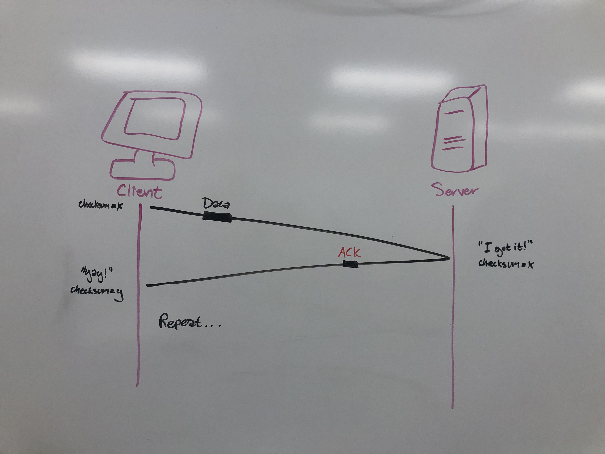
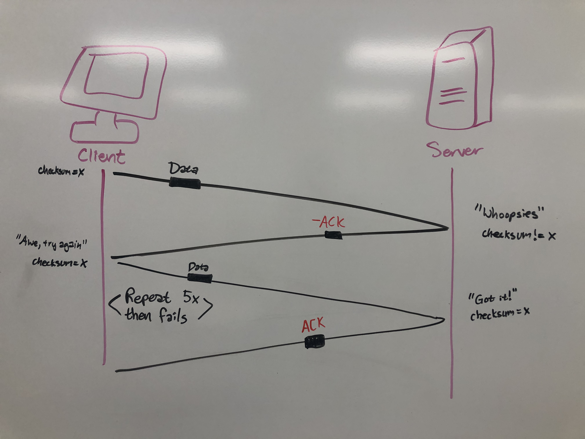

<meta charset="utf-8" lang="en">  <!-- this line allows UTF-8 characters in the .html file -->
	

 
	

                    ***RFC Project***
	

 
	

 
	

 
	

Author
==================================
	

 
	

 
	

<!-- fill out the following table with your information -->
	

<!-- Note: wrapping table in div.noheader will hide the table's header -->
	

<!-- Note: wrapping table in div.firstcol will style the first column different from other columns -->
	

	

name              | Rose White and Josh Meleski
	

Specification that describes the designed RFT protocol
==================================

Must be written in a precise way as if to communicate to an outsider how to implement the protocol
    • For the initial send of data from the client, we will assign sequential numbers to data packets before sending them across the network; and also include a checksum.
    • The server will check the numbers of the packets it has received and send acknowledgments back if it does or doesn’t receive the number it expected.
        ◦ We would check the sum (checksum) by flipping the bits and then adding it all up and seeing if it matches the original sum value also stored within the packet sent over.
    • If the sum is transferred correctly, then the server will send back a positive acknowledgment and store the data within a buffer until all the data has been received
    • The client will wait to receive an acknowledgment from the server before sending the next packet. If the acknowledgment is positive, the next packet will be sent; but if it is negative, the previous packet will be sent again. 
    • A timeout method will also be implemented in the case that a packet is dropped and never even reaches the reciever to get a positive or negative aknowledgement. In the case of a timeout, the client will resend the packet again.
        ◦ If you attempt to resend a packet more than five times, the whole process fails and an error message will be returned to the client.
<ul>
<li>First item</li>
<li>Second item</li>
<li>Third item</li>
<li>Fourth item</li>
</ul>	
	
	
	

 Packet sequence diagrams
==================================

 
 

 
	

 
	

How the design overcomes lost and out of sequence packets
===================
 

To overcome lost and out of sequence packets, we have implemented a method of sending the packets in order. A packet is sent and if the checksum and sequence number are correct, then a positive acknowledgment is sent and the next packet is sent. If the checksum or sequence number is incorrect, then a negative acknowledgment is sent back to the client; and the client re-sends the packet. A timeout will also be implemented to catch a delay in the sending of packets due to a packet being dropped. If a packet is sent more than 5 times and still fails, then the whole process fails and an error message is sent. 	

 
	

